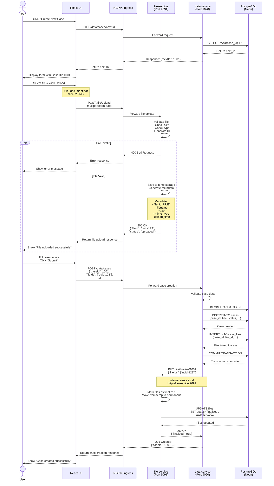

# File Upload Flow - Sequence Diagram

## Overview

This document details the complete flow of file upload operations in the system, showing how the `file-service` and `data-service` interact.

---

## File Upload Sequence Diagram



---

## Flow Steps Explained

### 1. Get Next Case ID

**Endpoint**: `GET /data/cases/next-id`

**Purpose**: Generate a unique case ID before form submission

**Process**:
1. User clicks "Create New Case"
2. UI requests next available case ID
3. `data-service` queries database for `MAX(case_id) + 1`
4. Returns new ID to UI
5. UI pre-fills form with case ID

**Why?**: Allows file uploads to be associated with a case ID even before case is fully created.

---

### 2. File Upload (Temporary)

**Endpoint**: `POST /file/upload`

**Request**:
```http
POST /file/upload HTTP/1.1
Host: app.local
Content-Type: multipart/form-data; boundary=----WebKitFormBoundary

------WebKitFormBoundary
Content-Disposition: form-data; name="file"; filename="document.pdf"
Content-Type: application/pdf

[binary file data]
------WebKitFormBoundary--
```

**Response**:
```json
{
  "fileId": "550e8400-e29b-41d4-a716-446655440000",
  "filename": "document.pdf",
  "size": 2621440,
  "mimeType": "application/pdf",
  "status": "uploaded",
  "uploadedAt": "2025-12-10T12:30:45Z"
}
```

**Process**:
1. `file-service` receives multipart file
2. Validates:
   - File size (max 10MB)
   - File type (allowed: pdf, png, jpg, doc, docx)
   - Filename not empty
3. Generates UUID for file
4. Saves to temporary storage location
5. Creates metadata record (not yet linked to case)
6. Returns file ID to UI

**Storage**: Files stored in `/tmp/uploads/{date}/{fileId}/`

---

### 3. Case Creation with File Linking

**Endpoint**: `POST /data/cases`

**Request**:
```json
{
  "caseId": 1001,
  "title": "Customer Support Request",
  "description": "Product defect report",
  "priority": "HIGH",
  "status": "OPEN",
  "fileIds": ["550e8400-e29b-41d4-a716-446655440000"]
}
```

**Process**:
1. `data-service` validates case data
2. Begins database transaction
3. Inserts into `cases` table
4. Inserts into `case_files` junction table (links case to files)
5. Commits transaction
6. Calls `file-service` to finalize files

---

### 4. File Finalization

**Endpoint**: `PUT /file/finalize/{caseId}` (internal service call)

**Request**:
```json
{
  "fileIds": ["550e8400-e29b-41d4-a716-446655440000"]
}
```

**Process**:
1. `file-service` receives finalization request from `data-service`
2. Validates all file IDs exist and are in "uploaded" status
3. Moves files from temporary to permanent storage
4. Updates database:
   ```sql
   UPDATE files 
   SET status = 'finalized', 
       case_id = 1001,
       finalized_at = NOW()
   WHERE file_id IN (...)
   ```
5. Returns success status

**Storage**: Files moved to `/data/files/{caseId}/{fileId}/`

---

## Error Handling

### File Upload Errors

| Error | HTTP Code | Response | User Action |
|-------|-----------|----------|-------------|
| File too large | 413 | `{"error": "File size exceeds 10MB"}` | Reduce file size or split |
| Invalid file type | 400 | `{"error": "File type not allowed"}` | Use allowed file types |
| No file provided | 400 | `{"error": "No file uploaded"}` | Select a file |
| Server error | 500 | `{"error": "Upload failed"}` | Retry upload |

### Case Creation Errors

| Error | HTTP Code | Response | User Action |
|-------|-----------|----------|-------------|
| Duplicate case ID | 409 | `{"error": "Case ID already exists"}` | Use next available ID |
| Invalid file ID | 404 | `{"error": "File  not found"}` | Re-upload file |
| Database error | 500 | `{"error": "Failed to create case"}` | Contact support |

### File Finalization Errors

| Error | Cause | Resolution |
|-------|-------|------------|
| File not found | FileID doesn't exist | Critical error - log and alert |
| File already finalized | Duplicate finalization call | Idempotent - return success |
| Move operation failed | Disk full or permissions | Alert ops team |

---

## Database Schema

### files Table

```sql
CREATE TABLE files (
    file_id UUID PRIMARY KEY,
    filename VARCHAR(255) NOT NULL,
    file_size BIGINT NOT NULL,
    mime_type VARCHAR(100),
    storage_path VARCHAR(500),
    status VARCHAR(20) DEFAULT 'uploaded', -- uploaded, finalized, deleted
    case_id INTEGER REFERENCES cases(case_id),
    uploaded_at TIMESTAMP DEFAULT NOW(),
    finalized_at TIMESTAMP,
    deleted_at TIMESTAMP
);
```

### case_files Junction Table

```sql
CREATE TABLE case_files (
    id SERIAL PRIMARY KEY,
    case_id INTEGER REFERENCES cases(case_id),
    file_id UUID REFERENCES files(file_id),
    attached_at TIMESTAMP DEFAULT NOW(),
    UNIQUE(case_id, file_id)
);
```

---

## API Endpoints Summary

### file-service APIs

| Method | Endpoint | Purpose |
|--------|----------|---------|
| POST | `/file/upload` | Upload file (temp storage) |
| GET | `/file/{fileId}` | Download file |
| DELETE | `/file/{fileId}` | Delete file |
| PUT | `/file/finalize/{caseId}` | Finalize uploaded files (internal) |
| GET | `/file/case/{caseId}` | List all files for a case |

### data-service APIs

| Method | Endpoint | Purpose |
|--------|----------|---------|
| GET | `/data/cases/next-id` | Get next available case ID |
| POST | `/data/cases` | Create new case |
| GET | `/data/cases/{id}` | Get case details |
| PUT | `/data/cases/{id}` | Update case |
| DELETE | `/data/cases/{id}` | Delete case |

---

## Configuration

### file-service

```yaml
# application.yml
file:
  upload:
    temp-dir: /tmp/uploads
    final-dir: /data/files
    max-size: 10485760  # 10MB
    allowed-types:
      - application/pdf
      - image/png
      - image/jpeg
      - application/msword
      - application/vnd.openxmlformats-officedocument.wordprocessingml.document

# Data service URL (internal)
data-service:
  base-url: http://data-service:9090
```

### data-service

```yaml
# application.yml
file-service:
  base-url: http://file-service:9091
```

---

## Performance Considerations

### File Upload

- **Chunked Upload**: For large files, implement chunked upload
- **Progress Tracking**: WebSocket or polling for upload progress
- **Async Processing**: Use queue for large file processing

### File Storage

- **Current**: Local filesystem (ephemeral in Kubernetes)
- **Recommended**: S3-compatible object storage (MinIO, AWS S3)

### Caching

- **File Metadata**: Cache in Redis for faster lookups
- **Download URLs**: Generate signed URLs with expiration

---

## Security

### Current Implementation

- Basic file type validation
- Size limits enforced
- No authentication (local development)

### Production Requirements

- ✅ Authentication & authorization
- ✅ Virus scanning (ClamAV)
- ✅ Encryption at rest
- ✅ Signed download URLs with expiration
- ✅ Audit logging for all file operations
- ✅ Rate limiting on uploads

---

## Future Enhancements

1. **Multi-file Upload**: Upload multiple files simultaneously
2. **Drag & Drop**: Improved UX with drag-drop interface
3. **File Versioning**: Keep history of file changes
4. **Thumbnail Generation**: Auto-generate thumbnails for images/PDFs
5. **File Preview**: In-browser preview for common formats
6. **Compression**: Automatic compression for large files
7. **Metadata Extraction**: Extract and store EXIF data, PDF metadata
8. **Virus Scanning**: Integrate ClamAV or similar

---

## Monitoring & Logging

### Key Metrics

- Upload success/failure rate
- Average upload time
- File sizes distribution
- Storage usage
- Failed finalization attempts

### Logging Points

```java
// file-service
log.info("File upload started: filename={}, size={}", filename, size);
log.info("File uploaded successfully: fileId={}, filename={}", fileId, filename);
log.error("File upload failed: filename={}, error={}", filename, error);
log.info("File finalized: fileId={}, caseId={}", fileId, caseId);
```

```java
// data-service
log.info("Case created: caseId={}, fileCount={}", caseId, fileIds.size());
log.info("Finalizing files for case: caseId={}, fileIds={}", caseId, fileIds);
```

---

## Testing

### Unit Tests

- File validation logic
- Metadata generation
- Storage path construction

### Integration Tests

- End-to-end upload → create → finalize flow
- Error scenarios (invalid file, missing case, etc.)
- Transaction rollback scenarios

### Load Tests

- Concurrent file uploads
- Large file uploads (near max size)
- Storage capacity testing

---

## Troubleshooting

### Files Not Appearing in Case

1. Check if upload succeeded: `GET /file/{fileId}`
2. Check case creation logs in `data-service`
3. Verify finalization was called
4. Check database: `SELECT * FROM case_files WHERE case_id = ?`

### Upload Fails Silently

1. Check `file-service` logs for errors
2. Verify disk space on file-service pod
3. Check file size doesn't exceed limit
4. Verify file type is in allowed list

### Files Not Finalizing

1. Check `data-service` → `file-service` connectivity
2. Verify service URLs in configuration
3. Check for transaction failures in logs
4. Verify file IDs exist in database
