# System Architecture

## Overview

The APP Replication system is a microservices-based application consisting of 5 Spring Boot services and a React frontend, deployed on Kubernetes with GitLab CI/CD automation.

---

## Architecture Diagram

```mermaid
graph TB
    subgraph "External"
        User[👤 User]
        GitLab[🦊 GitLab CE<br/>CI/CD]
    end
    
    subgraph "Kind Kubernetes Cluster"
        subgraph "Ingress Layer"
            Ingress[⚡ NGINX Ingress<br/>app.local]
        end
        
        subgraph "Frontend"
            UI[📱 React UI<br/>Port: 80]
        end
        
        subgraph "Backend Microservices"
            Data[💾 data-service<br/>Port: 9090]
            File[📁 file-service<br/>Port: 9091]
            RefData[📊 refdata-service<br/>Port: 9092]
            Search[🔍 search-service<br/>Port: 9093]
        end
        
        subgraph "Supporting Services"
            SMTP[📧 fake-smtp<br/>Ports: 1025, 1080]
            Registry[🐳 Docker Registry<br/>Port: 30500]
        end
    end
    
    subgraph "External Services"
        NeonDB[(🐘 Neon PostgreSQL<br/>Cloud Database)]
    end
    
    User -->|HTTPS/HTTP| Ingress
    Ingress --> UI
    Ingress --> Data
    Ingress --> File
    Ingress --> RefData
    Ingress --> Search
    
    UI -->|API Calls| Data
    UI -->|API Calls| File
    UI -->|API Calls| RefData
    UI -->|API Calls| Search
    
    File -->|Case Management| Data
    Data -->|Email Notifications| SMTP
    
    Data -->|Database Queries| NeonDB
    File -->|Database Queries| NeonDB
    RefData -->|Database Queries| NeonDB
    Search -->|Database Queries| NeonDB
    
    GitLab -->|Build & Push Images| Registry
    GitLab -->|Deploy via Helm| Data
    GitLab -->|Deploy via Helm| File
    GitLab -->|Deploy via Helm| RefData
    GitLab -->|Deploy via Helm| Search
    GitLab -->|Deploy via Helm| UI
    
    style User fill:#e1f5ff
    style GitLab fill:#ff9e64
    style Ingress fill:#7dcfff
    style UI fill:#9ece6a
    style Data fill:#bb9af7
    style File fill:#bb9af7
    style RefData fill:#bb9af7
    style Search fill:#bb9af7
    style SMTP fill:#f7768e
    style Registry fill:#73daca
    style NeonDB fill:#7aa2f7
```



---

## Component Details

### Frontend Layer

| Component | Technology | Port | Purpose |
|-----------|-----------|------|---------|
| UI | React 18 | 80 | User interface for case management |

### Backend Services

| Service | Technology | Port | Purpose |
|---------|-----------|------|---------|
| data-service | Spring Boot 3.2, Java 21 | 9090 | Core case management, CRUD operations |
| file-service | Spring Boot 3.2, Java 21 | 9091 | File upload/download, storage management |
| refdata-service | Spring Boot 3.2, Java 21 | 9092 | Reference data (countries, codes) |
| search-service | Spring Boot 3.2, Java 21 | 9093 | Search and query functionality |

### Infrastructure

| Component | Technology | Port(s) | Purpose |
|-----------|-----------|---------|---------|
| NGINX Ingress | NGINX | 80, 443 | Routing, load balancing, TLS termination |
| Docker Registry | Registry:2 | 30500 (NodePort) | Local container image storage |
| fake-smtp | Maildev | 1025, 1080 | Email testing in development |

### External Services

| Service | Provider | Purpose |
|---------|----------|---------|
| PostgreSQL | Neon (Cloud) | Primary database for all services |
| GitLab CE | Self-hosted (Docker) | Source control, CI/CD automation |

---

## Data Flow

### 1. User Interaction Flow

```
User → Ingress → UI → Backend Services → Database
```

### 2. File Upload Flow

```
User → UI → file-service → Validate → Store metadata → data-service → Update case
```

### 3. CI/CD Deployment Flow

```
Git Push → GitLab → Build → Test → Docker Build → Push to Registry → Helm Deploy → Pods
```

---

## Service Communication

### Inter-Service Communication

- **file-service** → **data-service**: HTTP REST (internal cluster communication)
  - URL: `http://data-service:9090`
  - Purpose: Link files to cases

- **All Backend Services** → **Database**: JDBC over SSL
  - Connection pooling: HikariCP
  - SSL Mode: require

### External Communication

- **All Services** → **fake-smtp**: SMTP port 1025
  - For email notifications in development

---

## Network Architecture

### Cluster Network

```
┌─────────────────────────────────────────────┐
│          Host Machine (Windows)              │
│                                               │
│  ┌─────────────────────────────────────┐    │
│  │    Kind Kubernetes Cluster           │    │
│  │                                       │    │
│  │  Network: 10.96.0.0/16 (ClusterIP)  │    │
│  │                                       │    │
│  │  Services:                            │    │
│  │  - data-service: 10.96.xxx.xxx:9090  │    │
│  │  - file-service: 10.96.xxx.xxx:9091  │    │
│  │  - ui: 10.96.xxx.xxx:80              │    │
│  │                                       │    │
│  │  Ingress exposes via:                 │    │
│  │  - Port 80 → 30080 (NodePort)        │    │
│  │  - Port 443 → 30443 (NodePort)       │    │
│  └─────────────────────────────────────┘    │
│                                               │
│  Port Forwarding:                             │
│  - localhost:80 → kind-control-plane:30080   │
│  - localhost:443 → kind-control-plane:30443  │
│  - localhost:30500 → registry:5000           │
└─────────────────────────────────────────────┘
```

### Access Points

| Endpoint | URL | Purpose |
|----------|-----|---------|
| Application UI | http://app.local | Main application interface |
| Application UI (HTTPS) | https://app.local | Secure application interface |
| Data Service API | http://app.local/data/* | Case management API |
| File Service API | http://app.local/file/* | File management API |
| RefData Service API | http://app.local/refdata/* | Reference data API |
| Search Service API | http://app.local/search/* | Search API |
| Fake SMTP UI | http://localhost:1080 | Email testing interface |
| GitLab | http://gitlab.local:8080 | Source control & CI/CD |
| Docker Registry | http://localhost:30500/v2/_catalog | Container registry |

---

## Technology Stack

### Backend
- **Framework**: Spring Boot 3.2.0
- **Language**: Java 21
- **Build Tool**: Maven 3.8
- **ORM**: Spring Data JPA, Liquibase
- **APIs**: Spring Web (RESTful)
- **Validation**: JSR-303 (Hibernate Validator)
- **Configuration**: Spring Cloud Config (local profiles)

### Frontend
- **Framework**: React 18
- **Build Tool**: Create React App
- **HTTP Client**: Axios
- **Routing**: React Router
- **UI**: Material-UI / Custom CSS

### Infrastructure
- **Container Runtime**: Docker 24+
- **Orchestration**: Kubernetes (Kind 0.20+)
- **Package Manager**: Helm 3
- **Ingress**: NGINX Ingress Controller
- **Service Mesh**: None (future consideration)

### CI/CD
- **SCM**: GitLab CE
- **CI/CD**: GitLab CI/CD Pipelines
- **Registry**: Local Docker Registry in Kind
- **Deployment**: Helm Charts

### Database
- **Type**: PostgreSQL 15
- **Provider**: Neon (Cloud-hosted)
- **Connection**: SSL/TLS required
- **Migrations**: Liquibase

### Development Tools
- **IDE**: VS Code, IntelliJ IDEA
- **API Testing**: Postman, curl
- **Log Viewing**: kubectl logs, k9s
- **Debugging**: Remote debugging via kubectl port-forward

---

## Deployment Architecture

### Development (Local)
```
Windows PC
  ├── Docker Desktop
  ├── Kind Cluster (3 nodes)
  ├── GitLab CE (Docker container)
  ├── GitLab Runner (Docker container)
  └── Browser → app.local
```

### Staging/Production (Future)
```
AWS Cloud
  ├── EKS Cluster
  ├── Application Load Balancer
  ├── ECR (Container Registry)
  ├── RDS PostgreSQL
  ├── Route53 (DNS)
  └── CloudWatch (Monitoring)
```

---

## Security Architecture

### Authentication & Authorization
- **Current**: None (local development)
- **Planned**: JWT-based authentication, role-based access control

### Network Security
- **Local**: HTTP (development only)
- **Production**: HTTPS with valid certificates, network policies

### Secrets Management
- **Local**: Kubernetes Secrets, environment variables
- **Production**: AWS Secrets Manager or HashiCorp Vault

### Database Security
- **Connection**: SSL/TLS enforced
- **Credentials**: Stored in Kubernetes Secrets
- **Access**: IP allowlisting (Neon)

---

## Scalability Considerations

### Current Setup
- Single replica per service
- No horizontal pod autoscaling
- No persistent volumes (stateless services)

### Future Production
- HorizontalPodAutoscaler for each service
- Multiple replicas (3+ per service)
- Database connection pooling tuning
- CDN for static assets
- Caching layer (Redis)

---

## Monitoring & Observability

### Current (Development)
- kubectl logs
- Kubernetes dashboard
- Application health endpoints (/actuator/health)

### Planned (Production)
- Prometheus for metrics
- Grafana for visualization
- ELK/Loki for log aggregation
- Jaeger for distributed tracing
- Alert Manager for notifications

---

## Disaster Recovery

### Current (Development)
- Git repository backup
- Manual database export
- Kind cluster ephemeral (recreated as needed)

### Planned (Production)
- Automated database backups (RDS)
- Multi-AZ deployment
- Disaster recovery runbooks
- Regular restore testing

---

## Next Steps

1. Implement authentication & authorization
2. Add monitoring & alerting
3. Set up production EKS cluster
4. Implement caching layer
5. Add rate limiting
6. Set up automated backups
